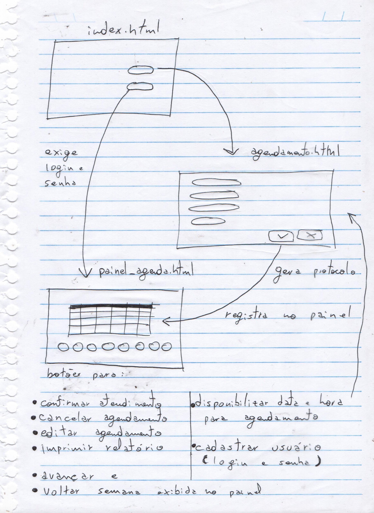
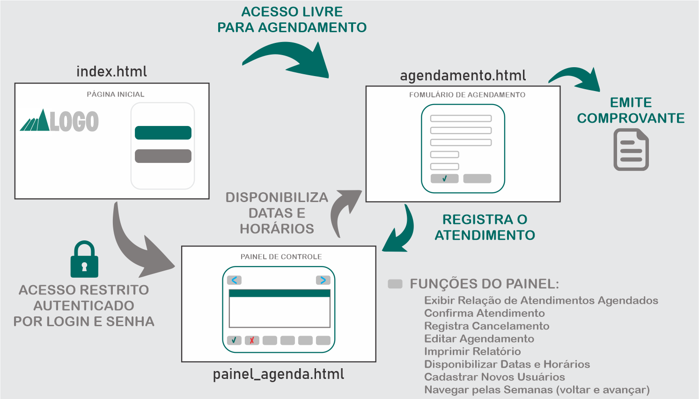

<h1 align="center"> Projeto de MVP </h1>
<h3 align="center"> Curso Técnologia em Análise e Desenvolvimento de Sistemas - UNIFESO </h3>

 

## 👨‍💻 Autores do projeto

Alexandre de Oliveira Silveira - <strong>Mat. 06007233</strong>
 
Murilo Mattos Torres - <strong>Mat. 06007772</strong>
 
Thiago de Andrade Rêgo Soriano - <strong>Mat. 06007616</strong>

## 📑 Descrição do projeto
A disciplina de MVP aborda o conceito de Menor Produto Viável onde o foco é na soluição prática para um desenvolvimento com rapidez e baixo custo.
Desenvolvido por alunos da Unifeso como ferramenta de avaliação da disciplina <strong>MVP Front-End Development</strong> do Curso de Tecnólogo em Análise e Desenvolvimento de Sistemas.

Nele foi utilizado o conceito de MVP (Menor Produto Viável) onde o foco é a solução prática para desenvolvimento com rapidez e baixo custo.

## 🎯 Objetivo e Situação problema

Fomos desafiados a criar, com base nas ferramentas já estudadas de front-end, uma solução digital que permita à população agendar seus atendimentos no NAF (Núcleo de apoio contábil e fiscal) de forma eficiente e conveniente. Mais especificamente, nossa meta é desenvolver um website que simplifique o processo de agendamento para aqueles que desejam obter assistência com suas declarações de Imposto de Renda e outros serviços oferecidos pelo NAF.

## 👨‍🏫 Instruções para utilização

O site possui dois caminhos: Um para o usuário padrão, que busca pelo atendimento do NAF e outro para o administrador da agenda que recebe os agendamentos, disponibiliza as datas e acompanha todos os cadastros realizados. Há também a possibilidade de realização de comentários onde fica aberto para utilização da população e funcionários. Parte dos recursos não está disponível por necessitar de aplicação de tecnologias ainda não praticadas pelo grupo.

## 🤖 Tecnologias aplicadas

Toda a estrutura do site foi elaborada com HTML e a estilização em CSS. A confirmação de login é apresentada através de JavaScript. A ferramenta principal de desenvolvimento foi o VS Code.

## 🚀 Metodologias Ágeis aplicadas

Realizamos o levantamento dos Requisitos Funcionais e Não Funcionais com base nos requerimentos descritos pela instituição no enunciado do desafio e nas funções aplicadas ao sistema.

Fizemos Sprints de reuniões semanais através do Método Scrum e uso da ferramenta Trelo para organizar e acompanhar as tarefas realizadas, aguandando e com dificuldade.

## 💡 Prototipação;

Os protóripos mostram o amadurecimento da estrutura e estilo das páginas.

<strong>Protótipo de Baixa Fidelidade:</strong> 
Representa o rascunho do projeto, após diversos esboços e brainstorm com a equipe, este foi o modelo selecionado para iniciar o desenvolvimento.

  

 
<strong>Protótipo de Média Fidelidade:</strong> 
Detalha melhor as cores, formatos e o fluxo entre as páginas através dos tipos de acessos. Onde o botão e setas verdes simbolizam o fluxo do usuário comum afim de marcar o agendamento e o botão e setas cinzas representam o acesso administrativo.

  

